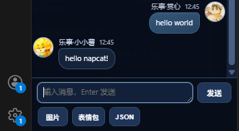
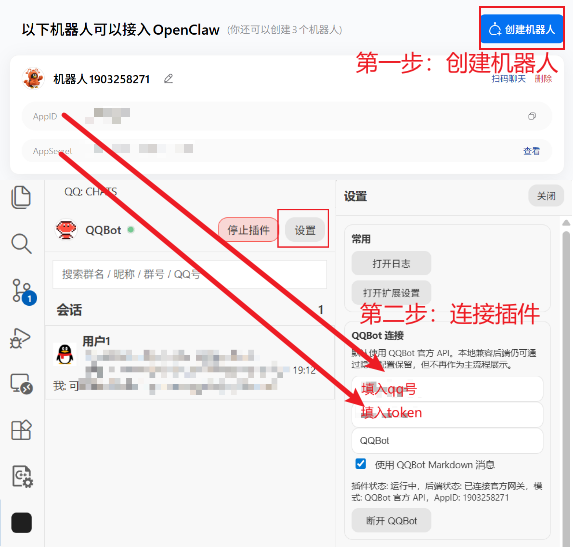

# VS Code QQ Copilot Connector

[English](./README.en.md)

QQ Copilot Connector 用来把 QQ 会话、VS Code Chat、语言模型和 MCP 工具能力整合到同一个工作流中。

## 项目说明

这个插件默认使用 QQ 官方 Bot API，把 QQ 会话放进 VS Code 侧边栏，同时提供一个可在 VS Code Chat 中直接使用的 `@qq` 助手入口。

## 功能特性

- VS Code 侧边栏会话列表与聊天详情页
- QQ 官方 Bot API 的私聊 / 群聊文本消息发送
- 图片发送与 QQBot Markdown 文本模式
- `@qq` Chat Participant，可在 VS Code Chat 中直接交互
- QQBot MCP 工具，可供 Copilot 调用
- QQ 远程自动回复，以及模型与工具联动处理
- 敏感工具的 `y/n` 确认执行流程
- 多窗口系统命令：`@list`、`@path`、`@model`
- 跟随 VS Code 主题的聊天界面、图片/视频预览
- 回复引用、合并转发预览、表情包面板、JSON 消息发送
- openid 私聊的匿名化显示

## 你可以用它做什么

- 在 VS Code 里直接阅读和回复 QQ 消息
- 在 VS Code Chat 中使用 `@qq`，让本地聊天和 QQ 远程消息共用同一套助手能力
- 让 Copilot 调用 QQBot MCP 工具发送消息、查看联系人、读取消息缓存
- 在多窗口工作时，把 QQ 会话路由到指定工作区窗口处理
- 在 QQ 侧通过 `y/n` 控制高风险动作是否继续执行

## 内置 MCP 工具

- `qqbot_send_private_message`
- `qqbot_send_group_message`
- `qqbot_configure_primary_conversation`
- `qqbot_list_messages`
- `qqbot_list_contacts`
- `qqbot_list_people`
- `qqbot_get_status`

## 快速开始

1. 前往https://q.qq.com/qqbot/openclaw/index.html注册qq机器人。
1. 安装插件。
2. 在设置中填写 QQBot AppID 和 ClientSecret。
3. 连接 QQBot。
4. 通过侧边栏处理 QQ 会话，或在 VS Code Chat 中使用 `@qq`。

## 远程系统命令

- `@list`：列出当前已注册的 VS Code 窗口与工作区路径
- `@path`：把当前远程会话切换到指定窗口，可用序号或路径指定
- `@model`：查看当前目标窗口可用模型列表，第一项为当前实际使用模型

## 相关项目

- [sliverp/qqbot](https://github.com/sliverp/qqbot)

## 说明

- 使用官方 QQBot 能力前，需要先配置有效的 AppID 和 ClientSecret。
- 某些高风险动作在执行前会要求确认。
- 当前产品定位以 QQBot 工作流为主。

## License

MIT